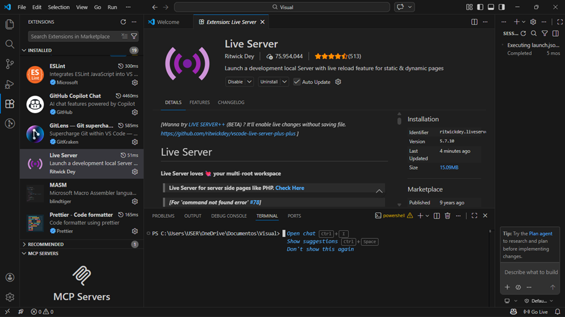
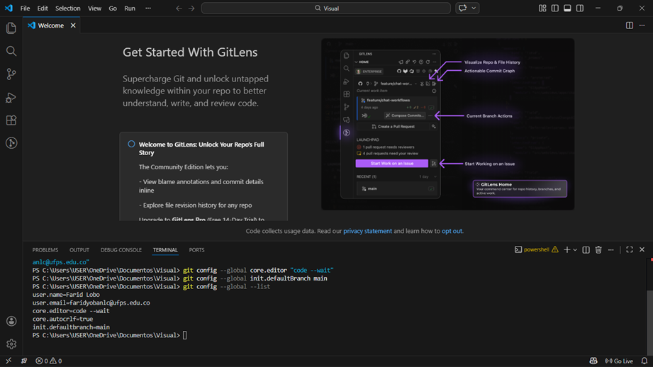
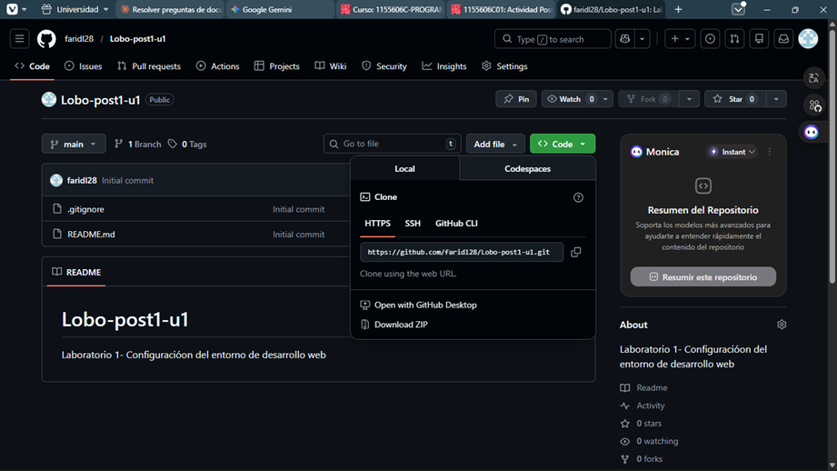
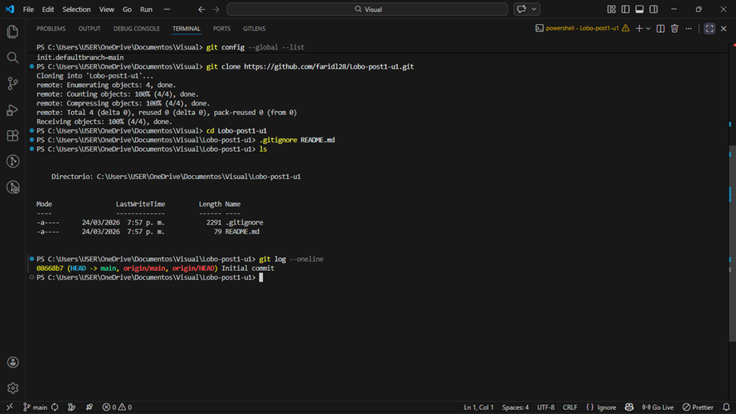
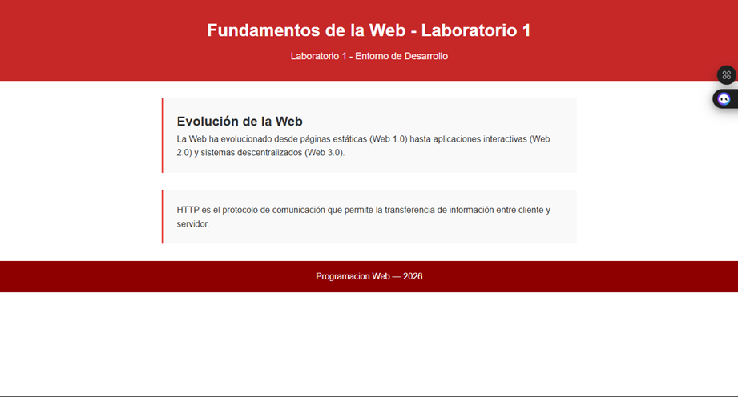
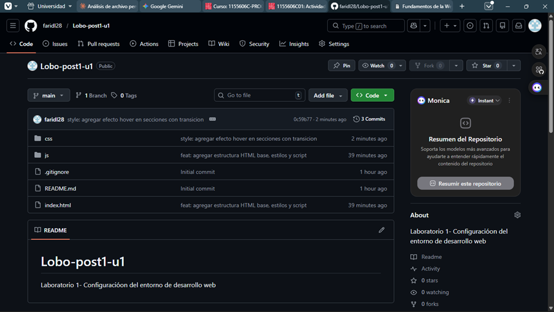
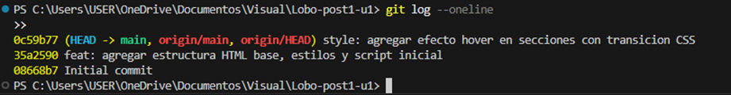
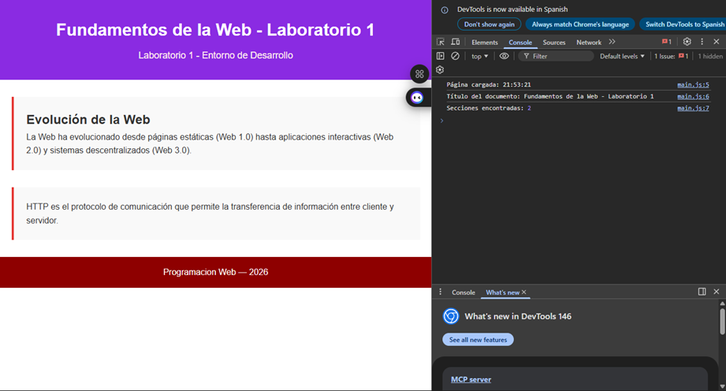
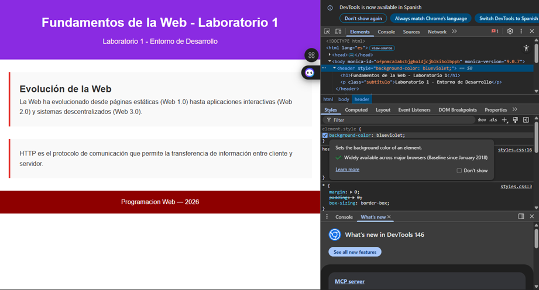

# Lobo-post1-u1
Laboratorio 1 - Configuración del entorno de desarrollo web

## Checkpoint 1 - VS Code y extensiones

## Checkpoint 2 - Git configurado

## Checkpoint 3 - Repositorio GitHub

## Checkpoint 4 - Página renderizada

## Checkpoint 5 - DevTools

